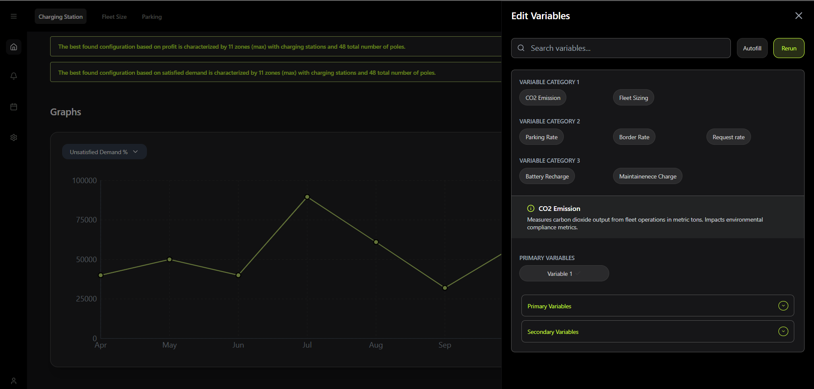
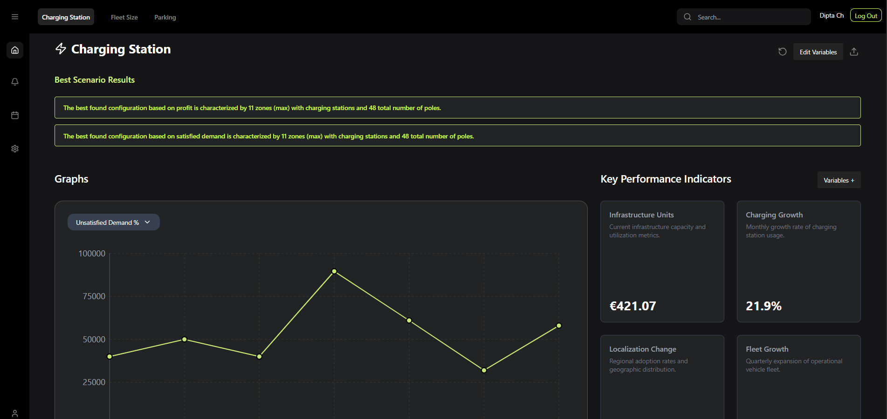

# Data Visualisation Dashboard 

 

## Live Demo

[Explore the Dashboard Live](https://data-visualisation-rho.vercel.app/)

A modern analytics dashboard built with **React**, **Typescript**, **Tailwind CSS**, and **Recharts** for data visualization. Features a dark theme UI with interactive charts, variable controls, and secure authentication powered by **Auth0**. State management handled by **Redux Toolkit (RTK)** for optimal performance.

## Table of Contents
- [Setup](#-setup)
- [Features](#-features)
- [Technical decisions and trade offs](#-technical-decisions-and-trade-offs)
- [Limitations](#-limitations)
- [Time Spent](#-time-spent)
## 🚀 Setup

### 1. Clone the repository

git clone https://github.com/diptachoudhury/Data-visualisation.git
cd analytics-dashboard

### 2. Install dependencies 
npm install

### 3. Environment Variables
VITE_AUTH0_DOMAIN=dev-801f84oe8budwof1.us.auth0.com
VITE_AUTH0_CLIENT_ID=ggQyaiPmEXBIPQNSjtjb0joUj6bmrwMK

### 4. Run the app 
npm run dev

## ✨ Features

### Core Functionality
- Interactive charts (Line, Bar, Area) with Recharts
- Responsive layout (mobile/tablet/desktop)
- Slide-Over Variable editing Card Interaction
- Data Point Hover Interaction
- Variable Selection Interaction [with RTK]

### UI Components
- Side navigation panel
- Top navigation bar
- Expandable variable editor
- KPI cards with trend indicators
- Responsive chart containers

## Technical decisions and trade offs

- Auth0 over Firebase	Enterprise security	More complex setup
- RTK over Context	Performance optimization	Boilerplate code
- Recharts over D3	

## Limitations
 - The chart data is static, have added multpliers on each factor which change the data.
 - auth might not work if deployed on local, Allowed web origins only include the deployed url.
 
## Time Spent
- 5 hrs 

##  Localdevelopment instructions
### 1. Clone the repository

git clone https://github.com/diptachoudhury/Data-visualisation.git
cd analytics-dashboard

### 2. Install dependencies
npm install

### 3. Environment Variables
VITE_AUTH0_DOMAIN=dev-801f84oe8budwof1.us.auth0.com
VITE_AUTH0_CLIENT_ID=ggQyaiPmEXBIPQNSjtjb0joUj6bmrwMK

### 4. Run the app 
npm run dev
